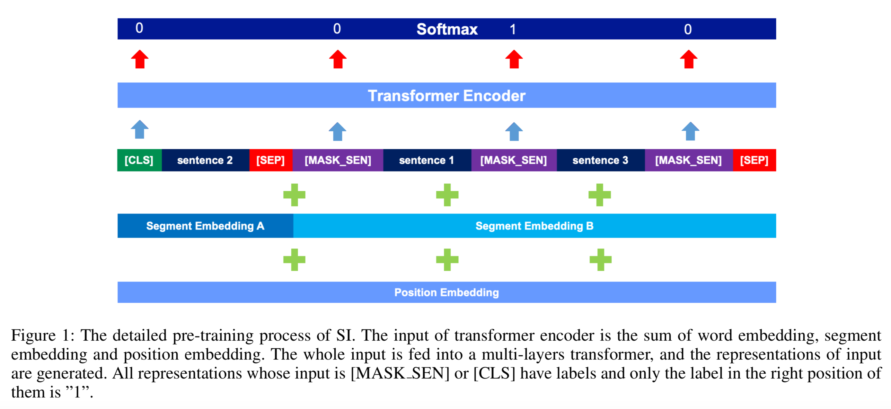

# SiBert Chinese

## Introduction

The Sentence Insertion based Bert (**SiBert**) is pretrained with the the sentence insertion task.

## Update Notes

* Sep 6, 2019: Initial release for SiBert code.

## Codes

1. create_pretraining_data.py
> Create the pretraining data for SiBert.

2. pretrain.py
> Pretrain the SiBert.

3. run_finetune_cmrc201x.py
> Finetune the SiBert for cmrc2018 and cmrc2019 tasks.

